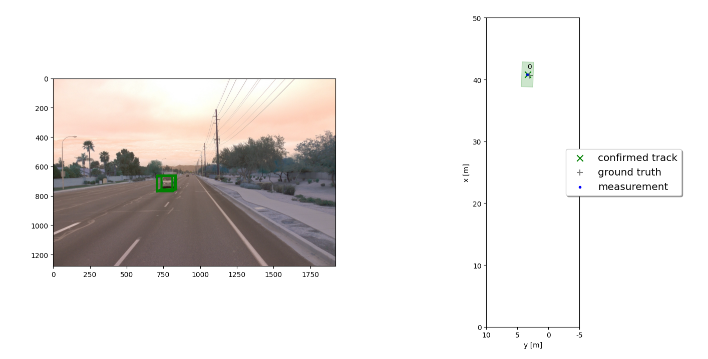
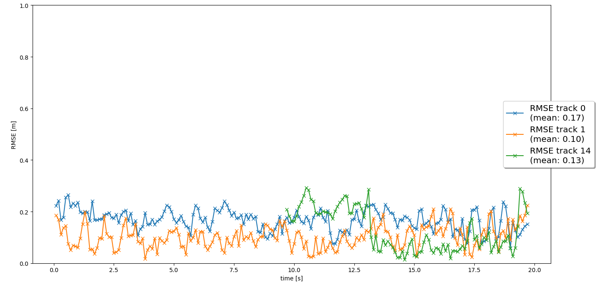

# Writeup: Track 3D-Objects Over Time

### 1. Write a short recap of the four tracking steps and what you implemented there (filter, track management, association, camera fusion). Which results did you achieve? Which part of the project was most difficult for you to complete, and why?

## Step 1 Tracking

At step 1 I've implemented an extended Kalmar Filter in the file student/filter.py. The objective was to track a single vehicle over time and track its position. The tracking is done using pre-computed Lidar detections. 
I've impemented:
- the system matrix F, 
- process noise covariance matrix Q, 
- the prediction and update functions,
- the residual gamma function and the covariance of residual S function. 

Tracking view:

RMSE:

As can be seen the achieved mean RMSE is smaller than the required value of 0.35 (smaller RMSE = better). 

## Step 2 Track Management

In this step I've implemented the track management functionality in the file student/trackmanagement.py. 
In the class 'Track' I've transformed the measurements to vehicle coordinates pos_veh, calculated the position estimation error covariance P_pos, set up the velocity estimation error covariance P_vel. In the class 'Trackmanagement' I wrote two functions, one for decreasing the score of unassigned track and the second for deleting track if certain conditions are met. The point is to eliminate tracks, which are no longer in proximity of the vehicle requiering consideration. I've also implemented the function 'handle_updated_track' at the end of the file. The vehicle is classified either as initialized, tentative, or confirmed based on its tracking score.  

Tracking view:

RMSE:

As expected in this project part, the RMSE plot shows a single line. 

## Step 3 Data Association

In step 3 I've implemented association functionality in the file student/association.py. A method that returns nearest track and measurement for association was implemented. Also, a gating method was introduced to reduce the complexity of the algorithm. In this step multiple vehicles are being tracked with a Lidar measurement update at each frame and appropriate association of new measurements to the tracks. 

Tracking view:

RMSE:

The mean RMSE value for the three tracks is below 0.25, which is a good result. 

## Step 4 Sensor Fusion

In this step both Lidar and camera data is being used to identify objects. In step 3 there were occasions where 'ghost tracks' were being wrongly identified, with the help of two sensors this issue is mitigated. I've implemented the Field of View member function inside of the Sensor class to identify, which tracks are in the FoV of a specific sensor 
and calculated the nonlinear measurement expectation value h(x).   

Tracking view:

RMSE:

The mean RMSE values meet the requirement of being less than 0.25 for the three tracks. 

The tracking video can be viewed on youtube: https://www.youtube.com/watch?v=CBiEex18r3I

### 2. Do you see any benefits in camera-lidar fusion compared to lidar-only tracking (in theory and in your concrete results)? 

Yes, in step 3 which only used the Lidar sensor I saw how the algorithm wrongly identified 'ghost objects' (false positives) and tracked them, however there were no vehicles present. The addition of another sensor improved the results, as there were now two sensor types cooperating in the task of object detection, which improved the identification and tracking results. 
As it was also seen in the previous parts of this course each sensor type has its advantages and disadvantages, so relying just on one to handle the autonomous vehicle seems unresanoable. Sensor fusion is a better approach at properly identififying the situation on the road. 

### 3. Which challenges will a sensor fusion system face in real-life scenarios? Did you see any of these challenges in the project?

False positives and false negatives are the biggest problems of sensor fusion systems in the real-life scenarios. Limiting their amount, or even duration will improve the quality of the results in the decision making process of the autonomous vehicle. These problems were visible in the project in steps 3 and 4, though less in step 4 as two sensor types were used there. 

### 4. Can you think of ways to improve your tracking results in the future?

The racking results would improve with more lidar and camera sensors available, in this project only one camera and lidar sensor were being used to identify objects. In a Waymo car there is a lot more camera and lidar sensors installed, which improve the confidence of the tracking results. Additionally the Waymo cars also have radar sensors and microphones. 
Also, in this project pedestrians and cyclists were not considered as tracked objects. So adding them to the tracking list would improve the tracking results. The results could also be improved by finetuning the KF parameters, or experimenting with the CNN to get better recall, precision and IoU results. 
